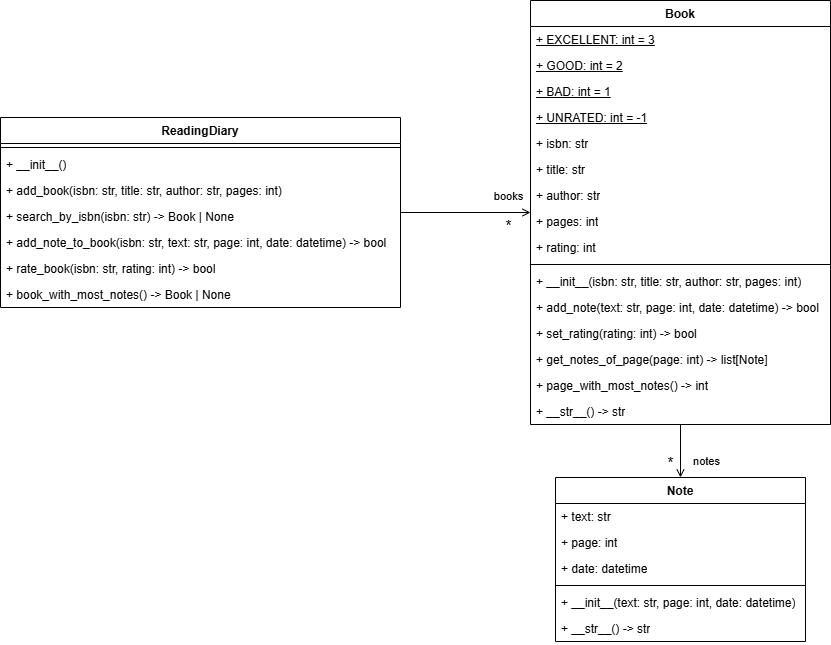

# Reading Diary [](README.es.md "Versión en español")

> **Total tests to evaluate: 62**

Reading diary is an application to asses the knowledge of OOP concepts in python. The application is a simple reading diary that allows users to add books and add notes to books to keep track of the reading progress. The application is implemented using classes and objects in python.

The model of the application is as follows:



The application code is incomplete, the idea is to complete it taking into account the following steps.

1. Complete the class `Note` taking into account the following requirements:
    - The class should have an `__init__` method that receives the following parameters:
        - `text` of type `str`.
        - `page` of type `int`.
        - `date` of type `datetime`.
        
        In the `__init__` method the class should initialize the attributes `text`, `page` and `date` with the values received as parameters.
    - The class should have an instance method `__str__` that returns a `str` with the following format:
        ```
        {date} - page {page}: {text}
        ```
        
        Where `{date}`, `{page}` and `{text}` should be replaced with the values of the attributes of the note.

2. Complete the `Book` class taking into account the following requirements:
    - The class should have a constant `EXCELLENT` of type `int` with value `3`.
    - The class should have a constant `GOOD` of type `int` with value `2`.
    - The class should have a constant `BAD` of type `int` with value `1`.
    - The class should have a constant `UNRATED` of type `int` with value `-1`.

    - The class should have an `__init__` method that receives the following parameters:
        - `isbn` of type `str`.
        - `title` of type `str`.
        - `author` of type `str`.
        - `pages` of type `int`.
    
        In the `__init__` method the class should initialize the attributes `isbn` of type `str`, `title` of type `str`, `author` of type `str` and `pages` of type `int` with the values received as parameters. The attribute `rating` of type `int` should be initialized with the value `Book.UNRATED` and the attribute `notes` of type `list[Note]` should be initialized as an empty list.

    - The class should have an instance method `add_note` that receives the parameters `text` of type `str`, `page` of type `int` and `date` of type `datetime` and returns a `bool` value. The method should do the following:
        - Checks if the `page` is greater than the total number of pages of the book. If it is, the method should return `False`.
        - Otherwise, the method should create a new `Note` object with the received parameters and add it to the `notes` list of the book. The method should return `True`.
    
    - The class should have an instance method `set_rating` that receives a parameter `rating` of type `int` and returns a `bool` value. The method should do the following:
        - Checks if the `rating` is not one of the constants `Book.EXCELLENT`, `Book.GOOD` or `Book.BAD`. If it is not, the method should return `False`.
        - Otherwise, the method should set the `rating` attribute of the book with the value of the parameter `rating` and return `True`.
    
    - The class should have an instance method `get_notes_of_page` that receives a parameter `page` of type `int` and returns a `list[Note]` with the notes of the book that are in the page received as parameter.

    - The class should have an instance method `page_with_most_notes` that returns an `int` with the page that has the most notes. If there are no notes in the book, the method should return `-1`.

    - The class should have an instance method `__str__` that return a `str` with the following format:
        ```        
        ISBN: {isbn}
        Title: {title}
        Author: {author}
        Pages: {pages}
        Rating: {rating}
        ```
        
        Where `{title}`, `{author}`, `{isbn}` and `{pages}` should be replaced with the values of the attributes of the book. The `{rating}` should be replaced with the string `"excellent"`, `"good"`, `"bad"` or `"unrated"` depending on the value of the attribute `rating`.
    
3. Complete the `ReadingDiary` class taking into account the following requirements:

    - The class should have an `__init__` method that initializes the `books` attribute of type `dict[str, Book]` as an empty dictionary.

    - The class should have an instance method `add_book` that receives the parameters `isbn` of type `str`, `title` of type `str`, `author` of type `str` and `pages` of type `int` and returns a `bool` value. The method does the following:
        - Checks if the `isbn` is not already in the `books` dictionary. If it is, the method should return `False`.
        - Otherwise, the method creates a new `Book` object with the received parameters and adds it to the `books` dictionary using the `isbn` as the key. The method should return `True`.
    
    - The class should have an instance method `search_by_isbn` that receives the parameter `isbn` of type `str` and returns `Book | None`. The method should return the book with the `isbn` received as parameter or `None` if the book is not found.

    - The class should have an instance method `add_note_to_book` that receives the parameters `isbn` of type `str`, `text` of type `str`, `page` of type `int` and `date` of type `datetime` and returns a `bool` value. The method should do the following:
        - Calls the `search_by_isbn` method with the `isbn` received as parameter. If the book is not found, the method should return `False`.
        - Otherwise, the method should call the `add_note` method of the book with the received parameters and return the value returned by the method.

    - The class should have an instance method `rate_book`. Copy the following code to the `ReadingDiary` class to complete the method:
        ```python
        def rate_book(self, isbn: str, rating: int) -> bool:
            book = self.search_by_isbn(isbn)
            if book is None:
                return False
            return book.set_rating(rating)
        ```
    
    - The class should have an instance method `book_with_most_notes` that returns `Book | None`. The method should return the book with the most notes or `None` if there are no books in the diary or if all the books have no notes.
